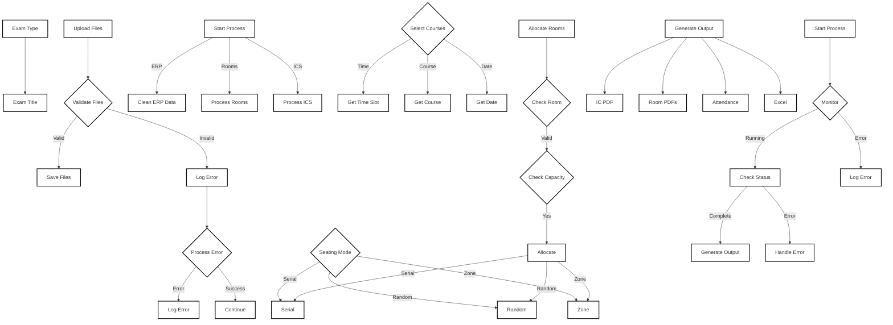

# Seating Allocation Software – Code Structure & Developer Guide

## Project Overview

This application automates the allocation of exam seating using uploaded data files. The backend is built with Flask (Python), and the frontend is a modern JavaScript app (likely using Vite + React or SvelteKit). This document explains the codebase for new developers.

---

## Directory Structure

```
Seating_Allocation_Software/
│
├── backend/                # Python Flask backend
│   ├── app.py              # Main Flask API (entry point for backend)
│   ├── main.py             # Core seat allocation logic
│   ├── allocate.py         # (Imported in main.py, contains allocation helpers)
│   ├── shared.py           # (Shared utilities)
│   ├── main_ops.py         # (Main operations)
│   ├── output.py           # (Output generation)
│   └── ...
│
├── exam-seating-app/       # Frontend (Vite + React or SvelteKit)
│   ├── src/
│   ├── public/
│   ├── package.json
│   └── ...
│
└── README.md
```

---

## Backend Overview

### 1. `app.py` (Flask API)

Main entry point for the backend, handling HTTP requests and responses.

#### Key Endpoints:

- `/upload-files` (POST): Uploads exam, ERP, and ICS files; triggers seat allocation in a subprocess.
- `/preview-output` (GET): Returns a preview of the generated output.
- `/download-output` (GET): Zips and sends output files for download.
- `/clear-output` (POST): Clears generated output files.
- `/upload-room-data` (POST): Uploads room data Excel files.
- `/stop-process` (POST): Stops any running seat allocation process.

### 2. `main.py` (Core Logic)

Orchestrates the seat allocation process based on input files and parameters.

#### Key Functions:

- **main()**: Entry point for allocation logic. Handles different modes (time slot, course number, or day).
- **process_course()**: Allocates seats and generates outputs for a specific course.
- **shuffle_within_rooms() / shuffle_within_zones()**: Shuffles students for randomization.
- **assign_zones()**: Assigns zones to rooms.

### 3. `allocate.py` (Room Allocation)

Handles room allocation logic and seat assignments.

#### Key Functions:

- **allocate_rooms()**: Main function for assigning students to rooms.
- **update_room_csv()**: Manages room status tracking.
- **load_lt_seating_arrangement()**: Handles LT room seating arrangements.

### 4. `allocate_ops.py` (Allocation Operations)

Contains helper functions for room allocation.

#### Key Functions:

- **read_room_status()**: Reads room status from CSV.
- **update_room_status()**: Updates room status during allocation.
- **get_available_seats()**: Calculates available seats in a room.

### 5. `main_ops.py` (Main Operations)

Handles data cleaning and validation.

#### Key Functions:

- **clean_reg_data()**: Cleans and processes ERP data.
- **read_rooms()**: Reads room allocation data.
- **validate_time_slot()**: Validates time slot format.
- **validate_course_number()**: Validates course number format.
- **validate_date()**: Validates date format.

### 6. `output.py` (Output Generation)

Handles PDF and Excel output generation.

#### Key Functions:

- **create_pdf()**: Generates IC PDFs.
- **create_output_excel()**: Creates master Excel output.
- **generate_room_pdfs()**: Creates room-specific PDFs.
- **create_attendance_pdfs()**: Generates attendance sheets.
- **combine_pdfs()**: Combines multiple PDFs into one.

### 7. `output_ops.py` (Output Operations)

Contains helper functions for output generation.

#### Key Functions:

- **prepare_pdf_data()**: Prepares data for PDF generation.
- **format_output_data()**: Formats data for Excel output.
- **generate_header()**: Creates PDF headers.

### 8. `shared.py` (Shared Utilities)

Contains shared constants, utility functions and modules.

#### Key Constants:

- **CC_lab**: Configuration for CC lab rooms.
- **ROOM_DATA_FOLDER**: Path to room data.
- **ROOM_STATUS_FILE_PATH**: Path to room status file.

#### Key Functions:

- **read_room_status()**: Reads room status.
- **update_room_status()**: Updates room status.
- **get_room_capacity()**: Gets room capacity.

---

## Backend Function Map

### app.py

- `upload_files()`: Handles file uploads, validates inputs, saves files, starts seat allocation process (calls `main.main`).
- `preview_output()`: Returns first 5 rows of output Excel as JSON.
- `download_output()`: Zips and sends output directory.
- `clear_output()`: Deletes all generated outputs.
- `upload_room_data()`: Handles upload and storage of room data Excel files.
- `stop_process()`: Terminates any running seat allocation process.
- `cleanup()`: Ensures clean exit and process termination on signals.

### main.py

- `main()`: Orchestrates allocation based on mode (time, course, day), loads data, calls `process_course()`.
- `process_course()`: Allocates seats and generates output for a course.
- `shuffle_within_rooms()`, `shuffle_within_zones()`: Shuffle students for randomization.
- `assign_zones()`: Assigns zones to rooms.

### allocate.py

- `allocate_rooms()`: Main room allocation function.
- `update_room_csv()`: Manages room status.
- `load_lt_seating_arrangement()`: Handles LT room seating.

### output.py

- `create_pdf()`: Generates IC PDFs.
- `create_output_excel()`: Creates master Excel.
- `generate_room_pdfs()`: Creates room-specific PDFs.
- `create_attendance_pdfs()`: Generates attendance sheets.

---

## How to Extend/Modify

- **To add a new endpoint:**
  - Define a new Flask route in `app.py`.
  - Implement logic or call helpers as needed.
- **To change allocation logic:**
  - Modify or extend functions in `main.py`, `allocate.py`, or `main_ops.py`.
- **To change output format:**
  - Edit `output.py` or the relevant section in `main.py`.
- **For new data types:**
  - Update file handling in `app.py` and data processing in `main.py`.

---

## Backend Flowchart (In Mermaid Syntax)



---

## Notes for Developers

- All file paths are relative to the backend directory.
- Long-running processes are managed using Python’s multiprocessing.
- Outputs are stored in the `Output/` directory.
- Errors are logged in `Output/error_log.json`, so the user can download error file as well.
- To debug, check console logs and error logs in Output.

---

For further details, see inline comments in each file or contact the project maintainer.

```

```
